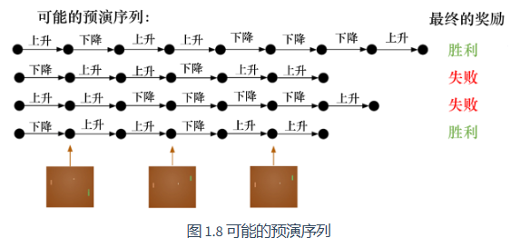

## 1.1 强化学习概述

#### 强化学习特点：
- 强化学习的输入一般为**序列输入**。许多监督学习假设样本是独立同分布的，而强化学习中，当前状态和动作会影响后续的状态和奖励，因此样本之间存在时间相关性。 
- **延迟奖励**。强化学习中，执行完动作后不会立即知道对或者错，只有等到游戏结束后才能知道这一系列动作对最终结果的影响。 （在大多数监督或者无监督学习中，模型的每一步输出都会跟标签进行对比，从而计算损失并更新参数。）
- **探索与利用的权衡**。强化学习中，**探索（exploration）**指尝试一些新的动作， 这些新的动作有可能会使我们得到更多的奖励，也有可能使我们“一无所有”；**利用（exploitation）**指采取已知的可以获得最多奖励的动作，重复执行这个动作，因为我们知道这样做可以获得一定的奖励。因此，需要在探索和利用之间进行权衡。

从一个起始帧（初始状态）开始，生成多局游戏，智能体在游戏中与环境交互，得到一系列轨迹（trajectory）。轨迹就是从起始帧一直到游戏结束的所有状态和动作的集合：
$$\tau = (s_0, a_0, s_1, a_1, \ldots)$$

结束后会得到最终奖励（eventual reward）。

一场游戏被称为一个**回合（episode）**，每个回合由多个**时间步（time step）**组成。下图展示了4个回合，每个回合有不同数量的时间步。

#### 强化学习相关概念
强化学习通过**动作**与环境交互，每次执行完**动作**后，环境会返回一个**奖励（reward）**和下一个**状态（state）**。智能体的目标是通过学习一个**策略（policy）**，在每个状态下选择最优的动作，从而最大化 **期望的累积奖励（expected cumulative reward）**。

- **奖励**：
  奖励是环境对智能体动作的反馈信号，表示该动作的好坏。奖励可以是正数（表示好的行为）或负数（表示坏的行为）。智能体的目标是最大化 **期望的累积奖励（expected cumulative reward）**。  